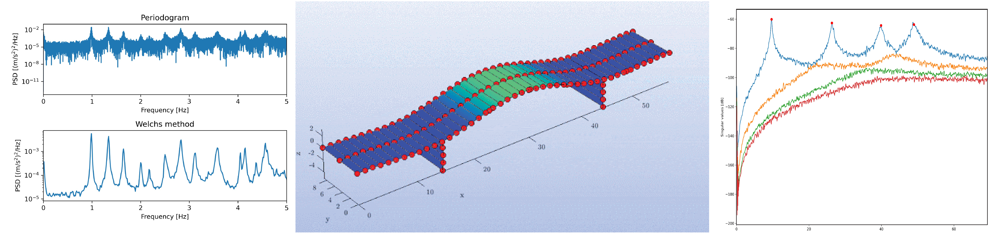

# Modal Analysis - MSc Lectures

     

**Modal Analysis and Damage Detection**. Lecture notes and codes  
*MSc in Structures, University of Granada, Spain.*
 
 
Course on vibration-based SHM, spanning from basic concepts  
of SHM and general pathologies in civil engineering structures,  
frequency-domain and time-domain OMA techniques, until  
damage detection algorithms following the pattern recognition paradigm. 
 
 
 
All the theoretical concepts are illustrated with codes written  
mostly in Python language.

